# Rick and Morty Flutter App

Мобильное приложение на **Flutter**, отображающее персонажей из мультсериала *"Рик и Морти"* с возможностью добавления в избранное, оффлайн-доступом и дополнительной информацией о персонажах, эпизодах и локациях.


### 🧑‍🚀 Главный экран (Список персонажей)
- Отображает всех персонажей в виде карточек.
- Каждая карточка содержит:
    - Фото персонажа.
    - Имя.
    - Статус (жив, мертв, неизвестно).
    - Вид и локация.
    - Кнопку "⭐" для добавления в избранное.
- Поддерживается **пагинация** — новые персонажи подгружаются при прокрутке списка.
- При клике на персонажа открывается **детальная страница** с дополнительной информацией и списком эпизодов.
- Сортировка (по имени (А-Я), по имени (Я-А), по статусу, по полу, по виду).
- Поиск по имени

 
### ⭐ Экран "Избранное"
- Содержит список персонажей, добавленных пользователем.
- Возможности:
    - Удалить персонажа из избранного.
    - Сортировать список (по имени, статусу и т.д.).
- Данные избранных сохраняются в локальной базе данных (Hive).

### 🌍 Детальные экраны
- **Персонаж:** подробная информация о герое и список эпизодов.
- **Эпизоды:** отображение всех серий, где появлялся персонаж.
- **Локации:** данные о месте происхождения и текущей локации персонажа.

### ⚙️ Навигация
- Удобный **BottomNavigationBar** для переключения между:
    - Главной страницей.
    - Избранным.

---
## Скриншоты

<table>
  <tr>
    <td>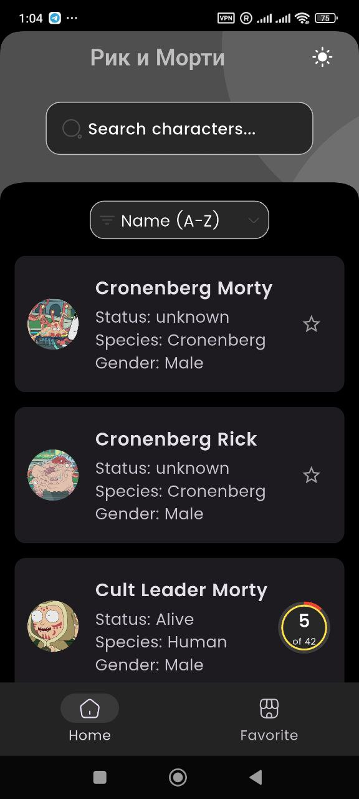</td>
    <td>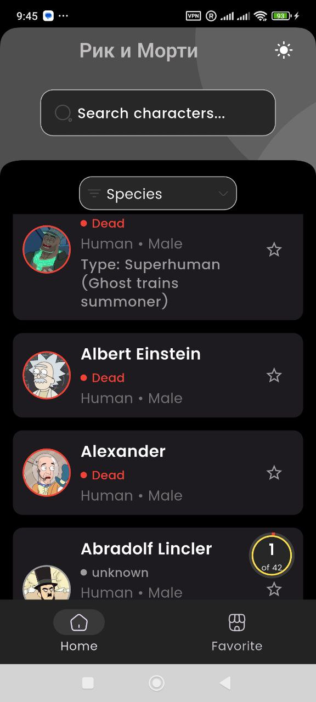</td>
    <td>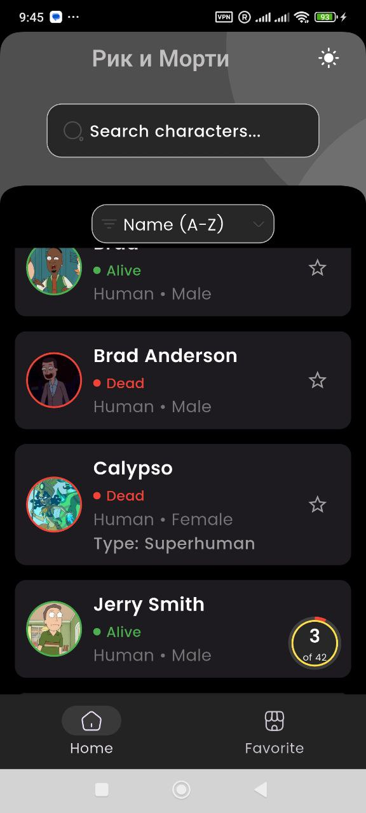</td>
  </tr>
  <tr>
    <td>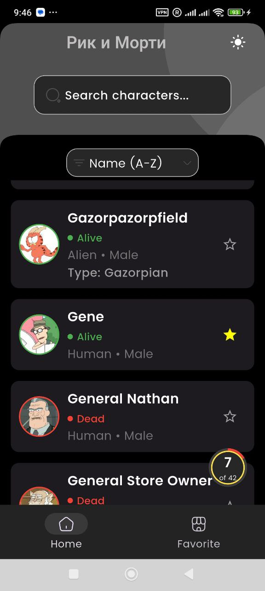</td>
    <td></td>
 <td></td>
<tr>
    <td>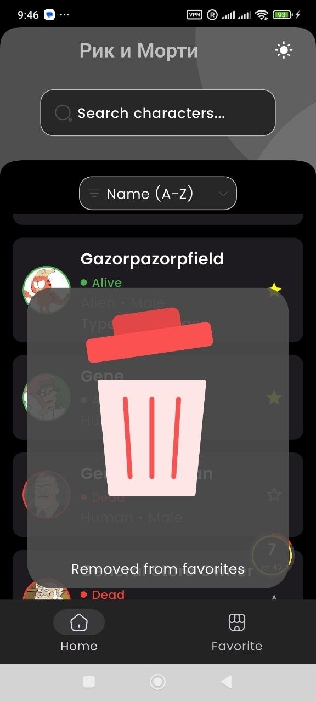</td>
    <td>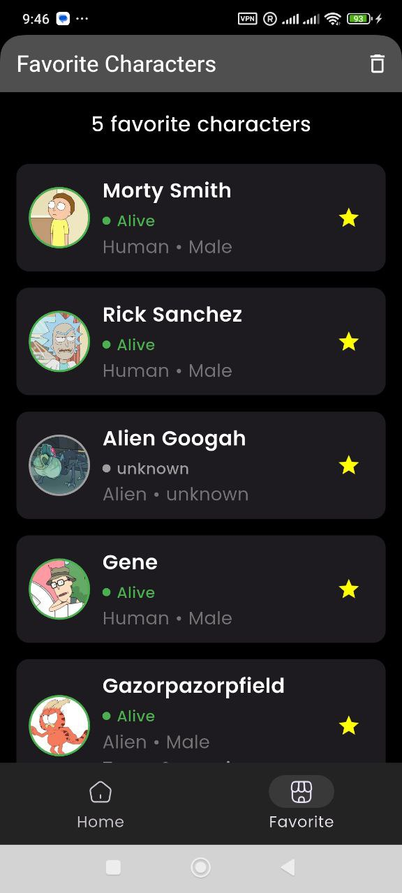</td>
    <td>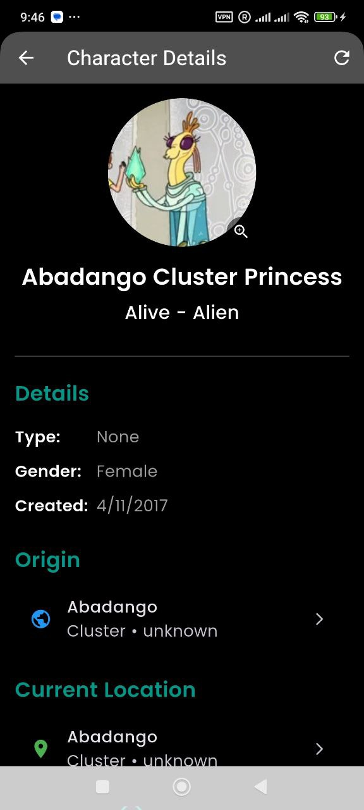</td>
  </tr>
  <tr>
    <td>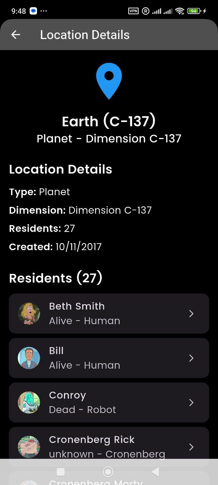</td>
    <td>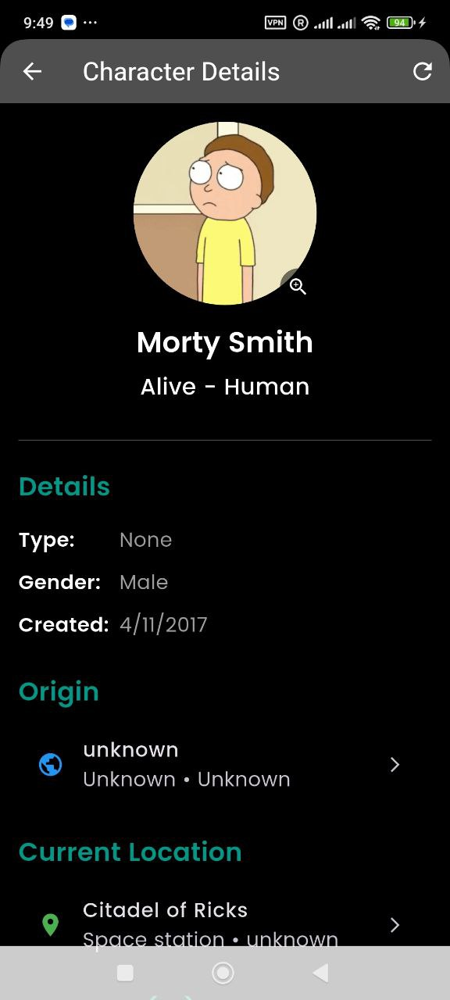</td>
 <td>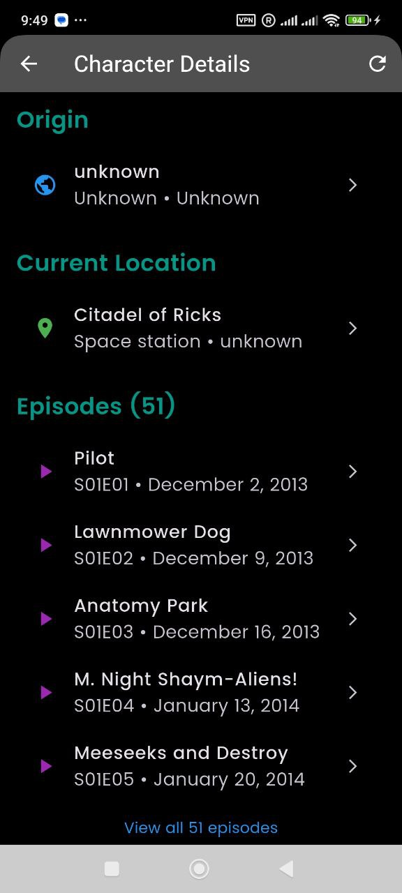</td>
</tr>
  <tr>
    <td></td>
    <td>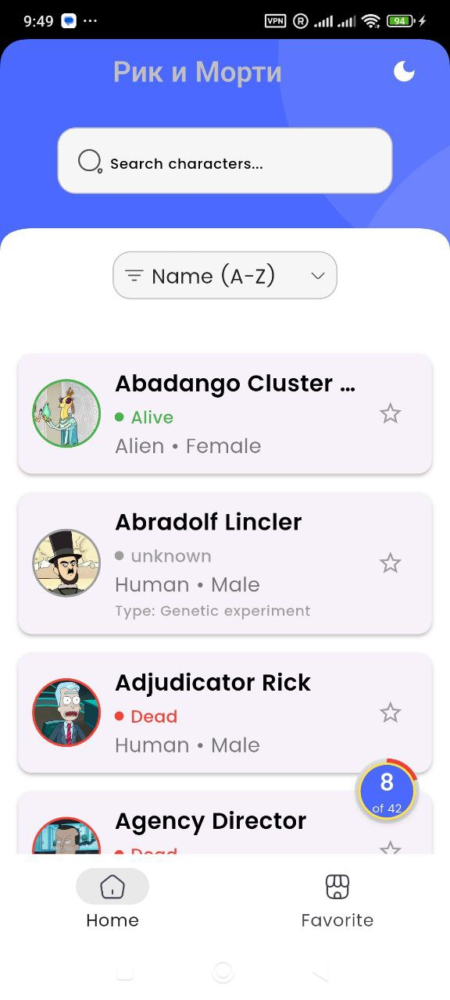</td>
 <td>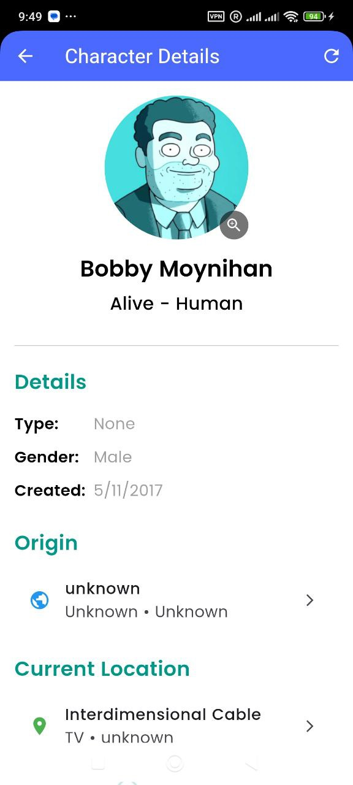</td>
</tr>
  <tr>
    <td>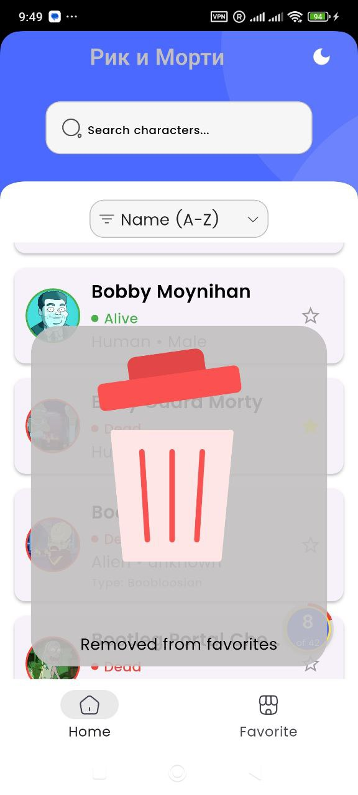</td>
    <td>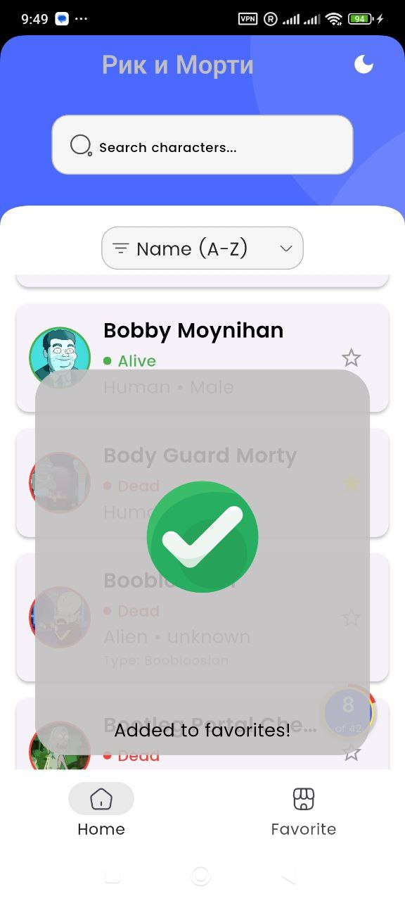</td>
 <td>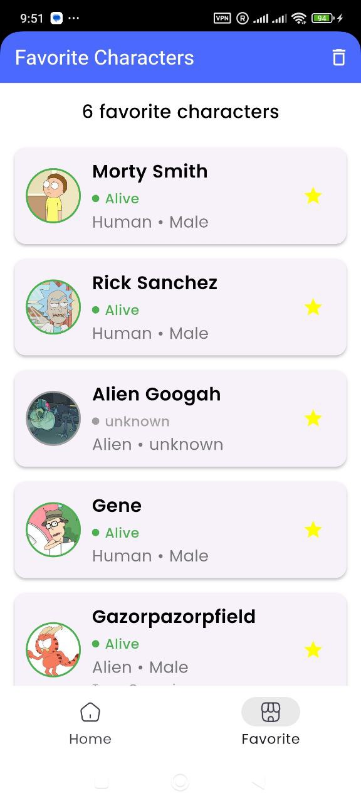</td>
</tr>
</table>
##  Архитектура проекта

Приложение построено по принципам **Clean Architecture** с разделением на независимые слои:


### Слои архитектуры
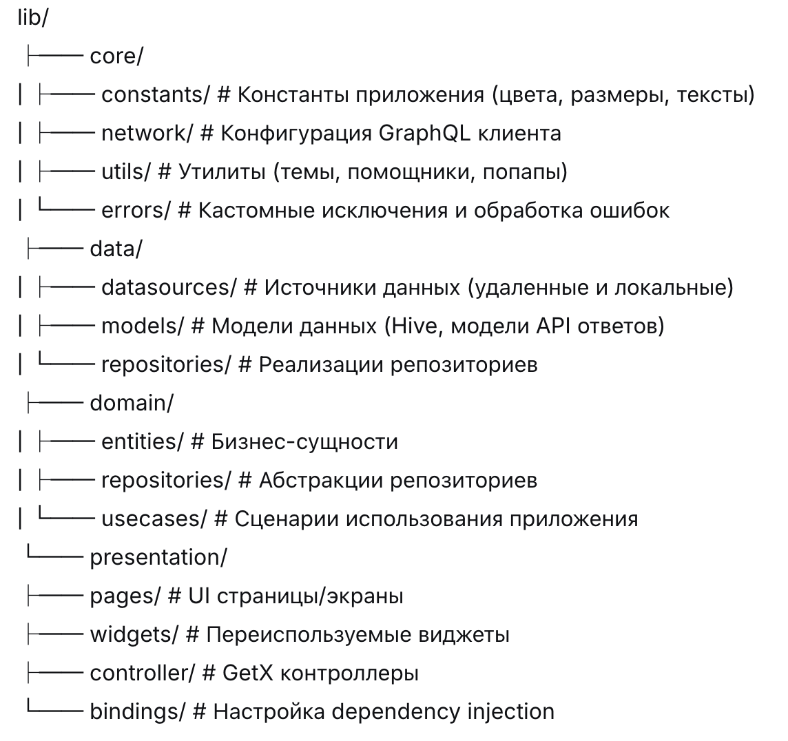
#### 1. Доменный слой (Бизнес-логика)
- **Entities**: Основные бизнес-объекты (`Character`, `Episode`, `Location`)
- **Repositories**: Абстрактные интерфейсы определяющие операции с данными
- **Use Cases**: Бизнес-правила специфичные для приложения

#### 2. Слой данных (Работа с данными)
- **Repositories**: Конкретные реализации доменных репозиториев
- **Data Sources**:
  - Remote: Источник данных GraphQL API
  - Local: База данных Hive для избранного и кэширования
- **Models**: Объекты передачи данных и модели Hive

#### 3. Presentation слой (UI)
- **Pages**: Виджеты экранов
- **Controllers**: GetX контроллеры для управления состоянием
- **Widgets**: Переиспользуемые UI компоненты
- **Bindings**: Настройка dependency injection


## 🛠️ Технические характеристики

### Версия Flutter
- **Flutter**: 3.7.0+


### Зависимости

#### UI & Иконки
- `cupertino_icons: ^1.0.8` - Иконки в стиле iOS
- `iconsax: ^0.0.8` - Красивый набор иконок

#### Управление состоянием & Навигация
- `get: ^4.7.2` - Управление состоянием, dependency injection и навигация

#### Сеть & API
- `graphql_flutter: ^5.2.1` - GraphQL клиент для Rick and Morty API
- `connectivity_plus: ^6.1.2` - Мониторинг сетевого подключения

#### Локальное хранилище & Кэширование
- `hive: ^2.2.3` - Легковесная NoSQL база данных
- `hive_flutter: ^1.1.0` - Интеграция Hive с Flutter
- `cached_network_image: ^3.3.0` - Кэширование изображений с поддержкой placeholder

#### Разработка & Утилиты
- `logger: ^2.5.0` - Красивая утилита логирования
- `lottie: ^3.2.0` - Поддержка Lottie анимаций


## 🚀 Ключевые особенности

### 1. Реализация Clean Architecture
- **Разделение ответственности**: Каждый слой имеет единую ответственность
- **Тестируемость**: Легко unit-тестировать каждый компонент
- **Поддерживаемость**: Четкие границы между слоями
- **Масштабируемость**: Легко добавлять новые функции

### 2. Управление состоянием с GetX
- Реактивное управление состоянием с `GetX` контроллерами
- Dependency injection с использованием `Get.put()` и `Get.lazyPut()`
- Навигация без контекста с использованием `Get.to()`
- Snackbars, диалоги и bottom sheets

### 3. Дизайн с оффлайн-подходом
- **Hive Database**: Локальное хранилище для избранного и данных персонажей
- **Кэширование изображений**: `CachedNetworkImage` для оффлайн доступа к изображениям
- **Осведомленность о подключении**: Автоматический переход на кэшированные данные при оффлайне

### 4. Интеграция GraphQL
- Эффективная загрузка данных с GraphQL запросами
- Типобезопасные взаимодействия с API
- Оптимизированные сетевые запросы

### 5. Современный UI/UX
- Адаптивный дизайн
- Поддержка темной/светлой темы
- Кастомные анимации с Lottie
- Состояния загрузки и обработка ошибок

## 📦 Установка

1. **Клонируйте репозиторий**
   ```bash
   git clone https://github.com/muhammadmajd/rick-and-morty.git
   cd rickmorty# rick-and-morty
